> ## Prerequisites
> To complete this episode you will need:
> 1. To have opened and configured your AWS account. These topics are covered in the first lesson: [Open your AWS account](https://cloud-span.github.io/create-aws-instance-1-open-account). 
> 2. Your account details: your **alias** or **12-digit number**, and your **IAM username** and **password**.
{: .prereq}

# Introduction
> ## Steps
> These are the main steps you will follow to create your AWS instance based on a Cloud-SPAN AMI:
>
> 1. **[Login to your (AWS) IAM user account](#1-login-to-your-aws-iam-user-account).**\
You should use your IAM user account, not your Root account, for creating your instance and for allocating and using any other AWS resources. 
>
> 2. **[Create a login key pair to securely access your instance](#2-create-a-key-pair).**\
> Access to your instance must be secured through encryption technology based on the matching of so called encrypted key files. You will create a pair of *key files*, one will be stored in your instance and the other will be stored on your computer. You can use a pair of key files with as many instances as you want. 
>
> 3. **[Create a security group](#3-create-a-security-group).**\
> A security group defines the communication channels/ports through which you can access your instance. You can use a security group with as many instances as you want. 
>
> 4. **[Create your instance based on the Cloud-SPAN AMI](#4-create-your-instance-using-a-cloud-span-ami).**\
> You will first select one of the Cloud-SPAN AMIs as the software template for your instance. You will then attach to your software template: (1) a (virtualised) hardware configuration that includes the number of processors and the amount of main memory, (2) the login key and (2) the security group configuration you in the two previous steps. Finally you will launch your instance.
{: .callout}

# 1. Login to your AWS IAM user account

Login to your IAM user account by opening a new browser window and entering the address of the login page for your IAM user account. The address contains you account alias or your 12-digit account number: 
- https://**youraccountalias**.signin.aws.amazon.com/console  
- https://**123456789012**.signin.aws.amazon.com/console

Enter your IAM username and password. You may also get a **Security check** to complete.

Once you are logged in, a page like the one below will appear.

**IMPORTANT**: On the top right, check that the region is set to Ireland. **Set it** to **Ireland** if it is not. 

Then click on the `EC2` orange icon.

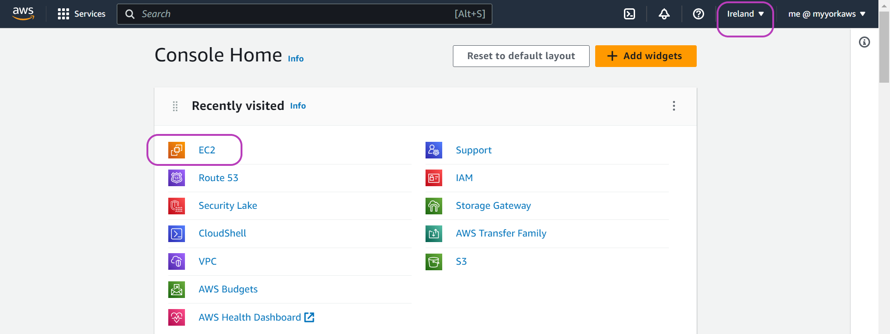{: width="900px"}

# 2. Create a key pair

You should now see the Elastic Compute Cloud (EC2) Dashboard /Resources. The EC2 navigation pane on the left gives access to other menu pages such as **Instances**, **Images** (AMIs), and other EC2 resources.

Scroll down the left navigation pane until you reach **Network & Security** and then click **Key Pairs**.  

 dashboard/Resources page and the option 'Key Pairs' on the left menu pane circled."){: width="900px"}

On the page that apears, "Key pairs", click on the orange button **Create key pair** on the top right. 

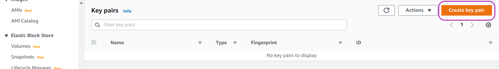{: width="900px"}

On the page that appears, "Create key pair":
1. Enter a name for your key pair. Choose a meaningful name --- you are going to save a file with that name for later use. We used 'cloud-span-login-key'.
2. Select **RSA** and **.pem** as shown in the page below. 
3. Click on **Create key pair** at the bottom right.

 and the RSA and .pem options are selected and circled"){: width="900px"}

Once you click on the **Create key pair** button in the page above, you will be prompted to save the key file. 

> ## Exercise
> We recommend that you create a new directory with a name that makes reference to your instance or work such as **cloud_genomics**  or **aws_instance** or **cloud-span-instance**. If you are a Windows user, you may want to create the directory in the Desktop so that you can easily access it.
> Now save the key file to that directory. If you used the name 'cloud-span-login-key', the file will be called 'cloud-span-login-key.pem'
{: .challenge}

> ## Important note on access
> You will need your 'login-key-file.pem' to be able to access your instance.
{: .callout}

After you save your login key the AWS Console will display a success message and your key pair listed.

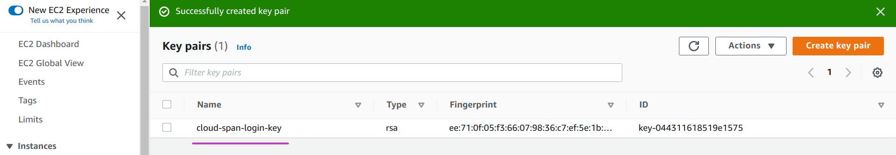{: width="900px"}

# 3. Create a security group
To create your security group select **Security Groups** under **Network & Security** on the left navigation pane. The "Security Groups" page will appear. 

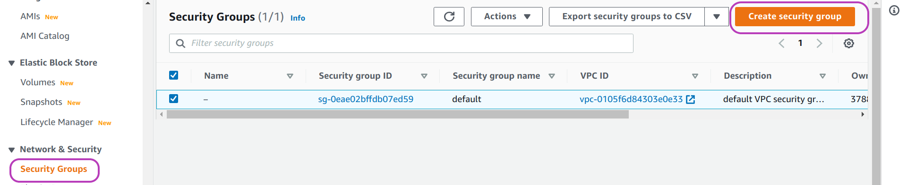{: width="900px"}

A **default** security group will be listed but we need to create a security group with specific settings for use with your instance. Click on the **Create security group** button on the top right. 

On the page that appears, "Create security group", add a name and a description for the security group you are about to create. We used *Cloud-SPAN Security Group* for the name and *For instances created from Cloud-SPAN AMI* for the description:

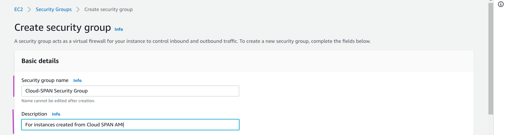{: width="900px"}

Now scroll down the page until you see the heading **Inbound rules**. 
We are going to specify four inbound rules.
1. Click the **Add rule** button four times so that four rows appear, see page below. 
2. On the left column (labelled **Type**), click the drop-down menu button and then select **SSH** for rows 1 and 2 and **Custom TCP** for rows 3 and 4.
3. On the third column (labelled **Port range**) enter the number **8787** on rows 3 and 4.
4. On the fourth column (labelled **Source**), click the drop-down menu button and then select **Anywhere-IPv4** for row 1 and 3 and **Anywhere-IPv6** for row 2 and 4.

The first four columns of the table should now look like this:

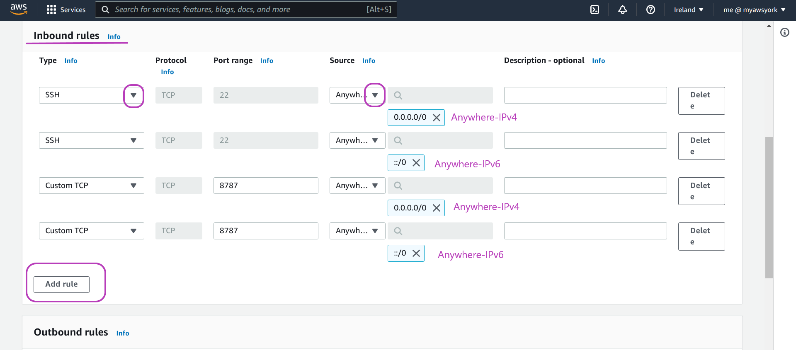{: width="900px"}

There is no need to define outbound rules nor tags. 

Scroll down to the end of the page and click **Create security group**. You should see the inbound rules for your security group listed as shown in the page below.

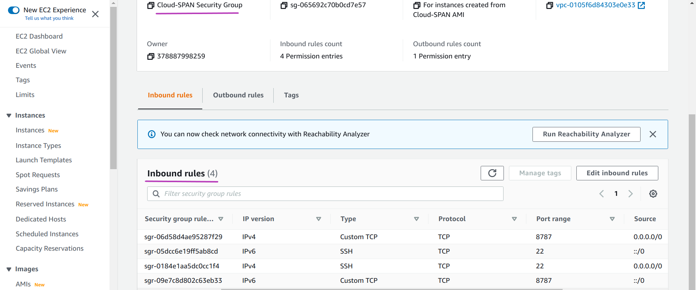{: width="900px"}

# 4. Create your instance using a Cloud-SPAN AMI

Creating your instance involves these steps:

4.1 Selecting a Cloud-SPAN AMI.

4.2 Selecting an instance type.

4.3 Selecting your login key.

4.4 Selecting your security group --- and launching your instance.

### 4.1. Selecting a Cloud-SPAN AMI

Use the EC2 navigation pane on the left to select and go to the **Instances** page and then click **Launch instances** on the top right:

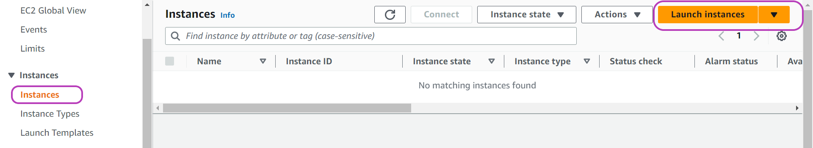{: width="900px"}

On the page that appears, "Launch an Instance": 
- Enter a name for your instance. 
- Copy-paste the AWS resource **id** (identification) of the Cloud-SPAN AMI of which you want your instance to be a copy:
  - Genomics AMI - id: **ami-00c0ea23e53f48472**
  - MetaGenomics AMI (Benchmarking data) - id: **ami-05638f7c51319ddba**
  - MetaGenomics AMI (Environmental data) - id: **ami-05f71c318f5ed1568** 
- Press Enter once you have copy-pasted the AMI-id.

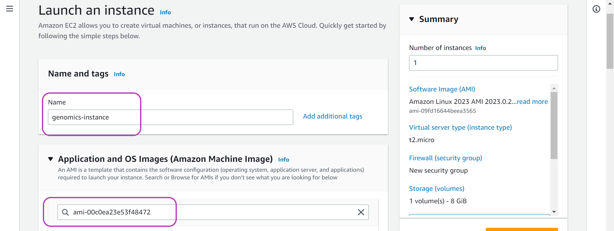{: width="900px"}

You will now be presented with the "Choose an Amazon Machine Image (AMI)" page. Click on **Community AMIs (1)**:

' page with the option 'Community AMIs (1)' circled."){: width="900px"}

The page will now display a description of the Cloud-SPAN AMI whose id you entered. Click on the **Select** button on the right. 

' page scrolled down and showing the details of the Cloud-SPAN AMI ami-00c0ea23e53f48472: CS-AMI08-30GB-UsrKeyMng-NoAuthKeys-EBScanIncrease-ENAenabled. AMI has (1) Elastic Network Adapter (ENA) enabled (2) 30GB of EBS storage (free tier), (3) can be increased , (4) no login keys (in /etc/ssh nor ubuntu ~/.ssh), (5) scripts copy the new sudo key to other accounts, when creating instances."){: width="900px"}

### 4.2. Selecting an instance type
Once you click on the **Select** button above, the page "Launch an Instance" will be displayed again summarising technical information of the Cloud-SPAN AMI selected. 

Scroll down the page until you see the heading **Instance type**. The box under this heading will show the technical specifications and price per hour of the instance type for the instance to be created. *By default*, this box shows the specifications and price of the instance type **t2.micro** and that it is *Free-tier eligible*, meaning that you will not incur compute cost for one year from opening your AWS account. This instance type has 1 CPU and 1 GB memory.  

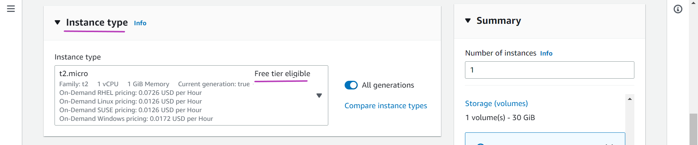{: width="900px"}

The instance type **t2.micro** can be used with the Genomics AMI --- **but should not be used** with the Metagenomics AMIs, as your instance will be too slow.

If you are creating your AWS instance with the Genomics AMI, we recommend that you use the instance type t2.micro first. And if you find your instance too slow, you can change to an instance type with more compute capacity as described in the next episode. If you decide on using the t2.micro instance type, continue below in [4.3 Selecting your login key](#43-selecting-your-login-key).

If you want to use the same instance type used by the Cloud-SPAN team with the Genomics AMI, namely, t3.small, or if you are creating your AWS instance with a Metagenomics AMI:

- click on the drop-down menu shown below --- a **search box** and a **list** of instance types will pop up.
- type **t3** in the search box so that the list gets updated to show t3 instance types only.
- scroll down the list until the instance type of your choice is shown:
  - **t3.small** for the Genomics AMI
  - **t3.2xlarge** for the Metagenomics AMIs
- select the your instance type by clicking anywhere inside its description box.  

Now scroll down untl you see the heading **Key pair (login)**.

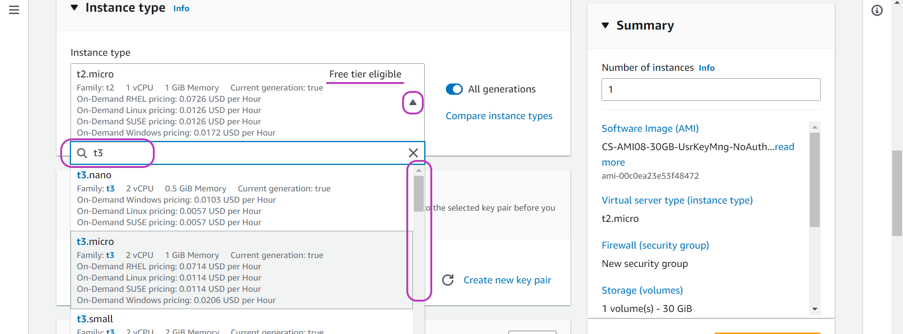{: width="900px"}

### 4.3. Selecting your login key 

You will now select the login key to be used to access your instance. Click the drop-down menu of the **Key pair name** box, and then click on the name of your login key that you created in Section [2 Create a key pair](#2-create-a-key-pair). 

' showing the search box and the previously created login key listed."){: width="900px"}

### 4.4. Selecting your security group - and launching your instance
Scroll down until you see the heading **Network settings**. Click on **Select existing security group** --- the box **Security groups** will be displayed. Click on the drop-down menu of this box, and check (or click on the name of) the security group your created in Section [3. Create a security group](#3-create-a-security-group).

Finally, click on the **Launch instance** button on the right.

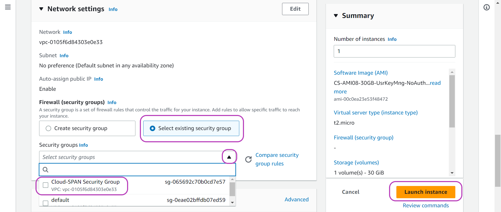{: width="900px"}

You will then be presented with the success message below. Click on **Instances** on the top left. 

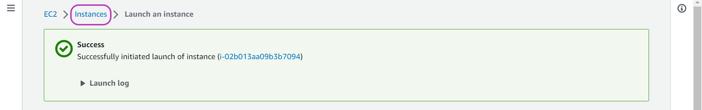{: width="900px"}

The "Instances" page will be presented showing that your instance has been created and is running:

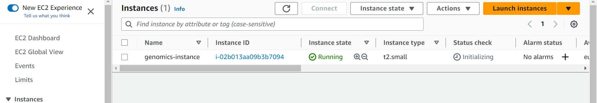{: width="900px"}

> ## Important note of cost
> Once launched, your instance will remain running until you stop it.  *If you selected an instance type other than t2.micro you are likely to incur some cost*. 
{: .callout}

The next episode [Manage Your AWS Instance](../02-manage-aws-instance) will introduce you to a few management tasks you need to operate your instance. 

