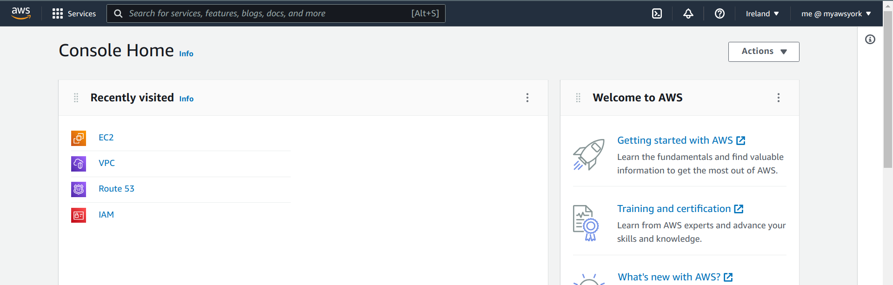
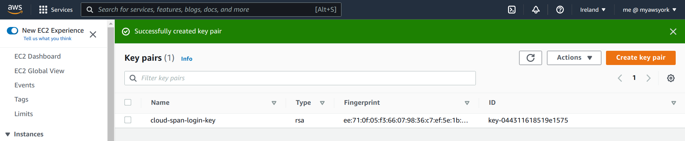
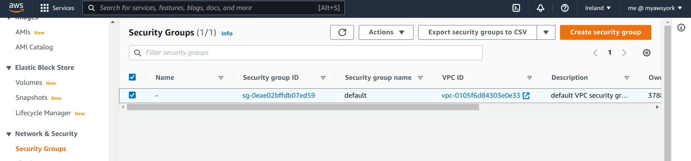
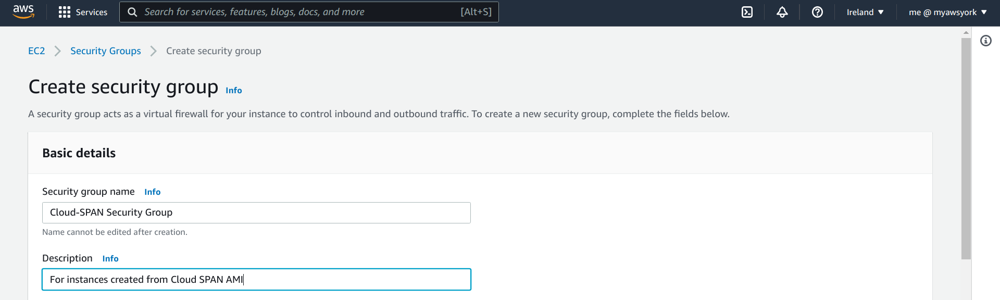
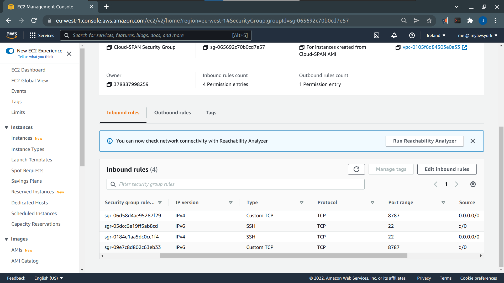
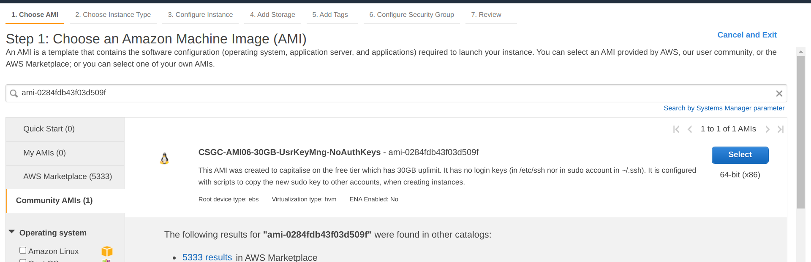
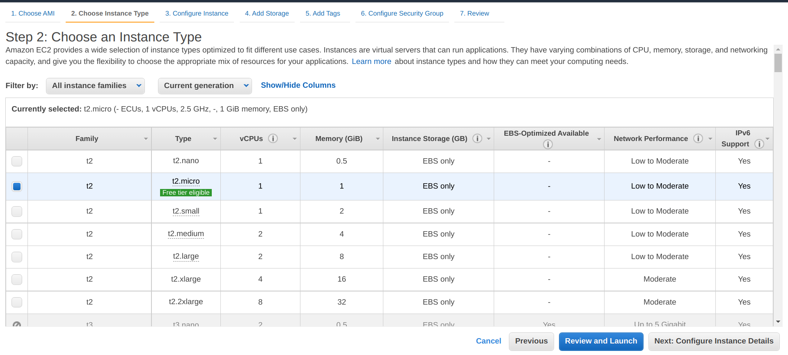
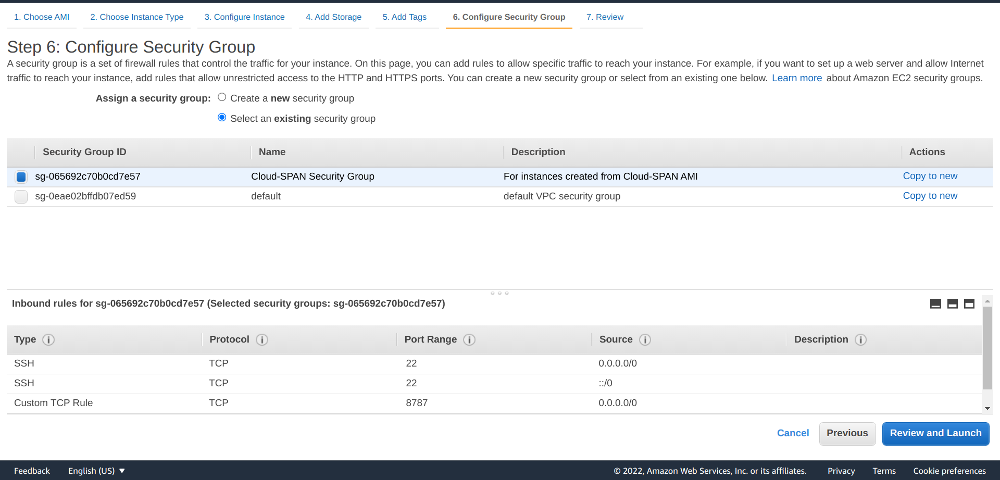

> ## Prerequisites
> To complete this episode you will need:
> 1. To have opened and configured your AWS account. These topics are covered in the first lesson: [Open your AWS account](https://cloud-span.github.io/create-aws-instance-1-open-account). 
> 2. Your account details: your **alias** or **12-digit number**, and your **IAM username** and **password**.
{: .prereq}

# Introduction
> ## Steps
> These are the main steps you will follow to create your AWS instance based on the Cloud-SPAN AMI:
>
> 1. **Login to your (AWS) IAM user account**.\
> You should use your IAM user account, not your Root account, for creating your instance and for allocating and using any other AWS  resources. 
>
> 2. **Create a login key pair to securely access your instance**.\
> Access to your instance must be secured through encryption technology based on the matching of so called encrypted key files. You will create a pair of *key files*, one will be stored in your instance and the other will be stored on your computer. 
>
> 3. **Create a security group**.\
> A security group defines the communication channels/ports through which you can access your instance. You can use a security group with as many instances as you want. 
>
> 4. **Create your instance based on the Cloud-SPAN AMI**.\
> You will first select the Cloud-SPAN AMI as the software template for your instance. You will then attach to your instance (1) a (virtualised) hardware configuration that includes the number of processors and the amount of memory, (2) the security group configuration and (3) the login key created in the two previous steps. The last step will launch your instance.
{: .callout}

# 1. Login to your AWS IAM user account

Login to your IAM user account by opening a new browser window and entering the address of the login page for your account IAM users. The address contains you account alias or your 12-digit account number: 
- https://**youraccountalias**.signin.aws.amazon.com/console  
- https://**123456789012**.signin.aws.amazon.com/console

Enter your IAM username and password. You may also get a **Security check** to complete.

Once you are logged in, a page like the one below will appear.

**IMPORTANT**: On the top right, check that the region is set to **Ireland**. Set it to Ireland if it is not. 

Then click on the `EC2` orange icon.

# 2. Create a key pair

You should now see the Elastic Compute Cloud (EC2) menu. The **Instances** page is displayed showing that currently you have no instances. The navigation pane on the left gives access to other menu pages such as **Images** (AMIs), **Network & Security** and other EC2 resources.

Scroll down the left navigation pane until you reach **Network & Security** and then select **Key Pairs**.  

On the page that apears, click on the orange button **Create key pair** on the top right. The page below will appear where you need to:
1. Enter a name for your key pair. Choose a meaningful name --- you are going to save a file with that name for later use. We used 'cloud-span-login-key'.
2. Select **RSA** and **.pem** as shown in the page. 
3. Click on **Create key pair** at the bottom right.

 and the RSA and .pem options are selected")

Once you click on the **Create key pair** button in the page above, you will be prompted to save the key file. 

> ## Exercise
> We recommend that you create a new directory named for your instance or work such as **cloud_genomics**  or **aws_instance** or **cloud-span-instance**. If you are a Windows user, you may want to create the directory in the Desktop so that you can easily access it.
> Now save the key file to that directory. If you used the name 'cloud-span-login-key', the file will be called 'cloud-span-login-key.pem'
{: .challenge}

After you save your login key you will see a success message and your key pair listed.

# 3. Create a security group
To create your security group select **Security Groups** under **Network & Security** on the left navigation pane. The Security Groups page will appear. A default security group will be listed but we need to create a security group with specific settings for use with your instance.

Click on the **Create security group** button on the top right. 

You now need to add a name and description for the security group. We used 'Cloud-SPAN Security Group' for the name and 'For instances created from Cloud-SPAN AMI' for the description.

Now scroll down the page until you see the heading **Inbound rules**. 
We are going to specify four inbound rules.
1. Click the **Add rule** button four times so that four rows appear. 
2. On the left column (labelled **Type**), select **SSH** for rows 1 and 2 and **Custom TCP** for rows 3 and 4
3. On the third column (labelled **Port range**) enter the number **8787** on rows 3 and 4
4. On the fourth column (labelled **Source**), select **Anywhere-IPv4** for row 1 and 3 and **Anywhere-IPv6** for row 2 and 4

The first four columns of the table should now look like this:

| Type          | Protocol      | Port Range    | Source        |
| ------------- | ------------- | ------------- | ------------- |
| SSH           | TCP           | 22            | Anywhere-IPv4 |
| SSH           | TCP           | 22            | Anywhere-IPv6 |
| Custom TCP    | TCP           | 8787          | Anywhere-IPv4 |
| Custom TCP    | TCP           | 8787          | Anywhere-IPv6 |

There is no need to define outbound rules nor tags. 

Scroll down to the end of the page and click **Create security group**. You should see the inbound rules for your security group listed.

# 4. Create your instance using the Cloud-SPAN AMI as source

Creating your instance involves these steps:

4.1 Selecting the Cloud-SPAN AMI as source.

4.2 Selecting an instance type.

4.3 Selecting the security group.

4.4 Selecting the login key --- after this selection your instance will be automatically launched.

### 4.1. Selecting the Cloud-SPAN AMI

Use the left navigation pane to select and go to the **Instances** page and click **Launch instances** on the top right. 

Copy-paste the Cloud-SPAN AMI id **ami-00c0ea23e53f48472** into the AMI search box and press Enter.

You should now see that AMI listed with its full name and a bried description of its configuration, similar to this: 

**CS-AMI08-30GB-UsrKeyMng-NoAuthKeys-EBScanIncrease-ENAenabled**\
ami-00c0ea23e53f48472 (CS-AMI08-30GB-UKM-NAK-EBS+ENA)\
AMI has (1) Elastic Network Adapter (ENA) enabled (2) 30GB of EBS storage (free tier), (3) can be increased, (4) no login keys (in /etc/ssh nor ubuntu ~/.ssh), (5) scripts copy the new sudo key to other accounts, when creating instances.

Click **Select** on the right to choose the AMI.

### 4.2. Select an instance type
This is where we determine the combination of CPU, memory, storage and networking capacity of the instance. The instance type **t2.micro** should be selected by default. This instance type is *Free tier eligible*, meaning that you will not incur costs for using this instance type for 12 months since you opened you account. 

We recommend that you use this instance type first but we show you show to change to an instance type with greater capacity in the next episode.

Now go to **6. Configure security group** at the top (we don't need the other steps).  

### 4.3. Selecting your security group
You will now see the options to **Create a new security group** or to **Select an existing security group**. We created a security group in Step 3 so choose **Select an existing security group**. 

The page will refresh listing the default security group and the security group "Cloud-SPAN Security Group" that we created in step 3. Select "Cloud-SPAN Security Group" and click **Review and launch**.

You will be presented with a summary of your instance configuration. You will need to scroll down to see all the details. The summary includes a warning in yellow: "... Your security group, Cloud-SPAN Security Group, is open to the world". This means that you can access your instance from any machine. This is of no concern as long as you don't share your login key file. 

Click on **Launch** on the bottom right. 

### 4.4. Selecting your login key - and launching your instance

You will now be prompted to select the login key to be used to access your instance. The key pair you created in Step 2  will be selected as default. You should also have saved the key, 'cloud-span-login-key.pem' to your computer. Check the box to acknowledge that you have saved and have access to the key file. 

> ## Important note on access
> You need your 'cloud-span-login-key.pem' to be able to access your instance
{: .callout}

Once you check the acknowledge box, you will then be able to click on **Launch Instances** to trigger the launch of your instance.

> ## Important note of cost
> Once launched your instance will remain running until you stop it.  *If you selected an instance type other than t2.micro you are likely to incur some cost*. 
{: .callout}

Once you **Launch Instances** you will be informed the instances are launching. Scroll down the page and click on **View Instances** to go the Instances menu page where you will see your instance in the state *Pending* or *Running*.

The next episode [Manage Your AWS Instance](../02-manage-aws-instance) will introduce you to a few management tasks you need to operate your instance. 

