> ## Prerequisites
> To complete this episode you will need to have:
> 1. opened your AWS account --- if you haven't done so, follow the instructions in lesson 1 - episode 1: [Create Your AWS Account](https://cloud-span.github.io/create-aws-instance-1-open-account/01-create-your-account). 
> 2. configured your AWS account with an IAM (Identity and Access Management) user account --- if you haven't done so, follow the instructions in lesson 1 - episode 2:  [Configure Your AWS Account](https://cloud-span.github.io/create-aws-instance-1-open-account/02-configure-your-account)
> 
> You also need your account **alias** or **12-digit number**, and your **IAM username** and **password**.
{: .prereq}

# Introduction
> ## Steps
> These are the main steps you will follow to create your AWS instance based on the Cloud-SPAN AMI:
>
> 1. **Login to your (AWS) IAM user account**.\
> You should use your IAM account for creating your instance and for allocating and using any other AWS  resources. (Your Root account should only be used for high-level admin tasks such as updating billing information.)
>
> 2. **Create a login key pair to securely access your instance**.\
> Access to your instance must be secured through encryption technology based on the matching of so called encrypted key files. You will create a pair of key files, one will be stored in your instance and the other one you will send it when accessing your instance to be matched with the first one. You can use a login key pair with as many instances as you want. 
>
> 3. **Create a security group**.\
> A security group defines the communication channels/ports through which you can access your instance. You can use a security group with as many instances as you want. 
>
> 4. **Create your instance based on the Cloud-SPAN AMI**.\
> You will first select the Cloud-SPAN AMI as the software template for your instance. You will then attach to your instance (1) a (virtualised) hardware configuration that includes the number of processors and the amount of memory, (2) the security group configuration and (3) the login key created in the two previous steps. The last step will launch your instance.
{: .callout}

# 1. Login to your AWS IAM user account

Login to your IAM user account as follows. Open a new browser window and enter the address of the login page for your account IAM users; it is something like the following but you must use either your actual account alias or your 12-digit account number: 
- https://**youraccountalias**.signin.aws.amazon.com/console  
- https://**123456789012**.signin.aws.amazon.com/console

A page like the one below will appear. Please enter your IAM username and password. 

If a **Security check** box pops up, complete it by typing the characters displayed into the box.

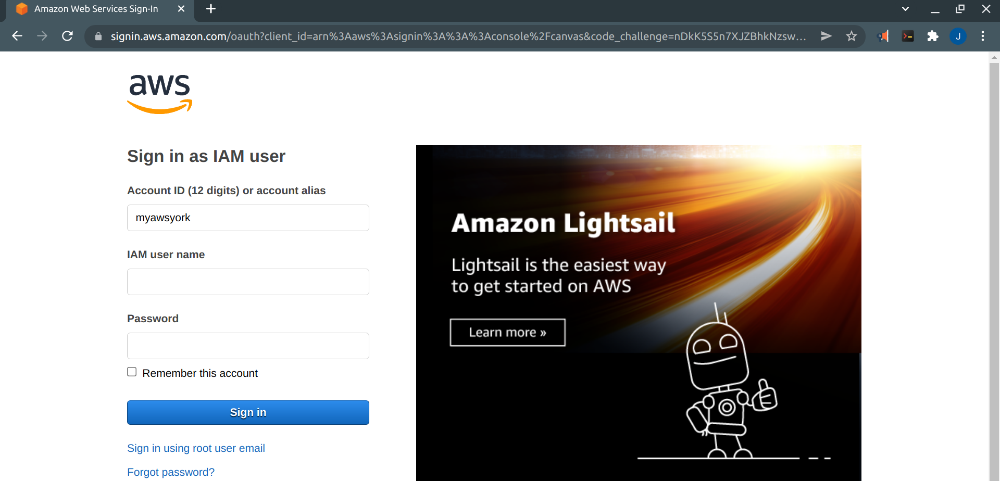

Once you are logged in, a page like the one below will appear.

**IMPORTANT**: please check on the right of the AWS navigation bar (the black one at the top) that the default region is set to **Ireland** as shown. Set it to Ireland if it is not. 

Then click on the `EC2` orange icon --- or type **ec2** in the AWS search box and press Enter. Go to step 2. 

# 2. Create a key pair

You should now see the Elastic Compute Cloud (EC2) menu page shown below, or a similar one. The page below is the **Instances** menu page, with no instances as none has been created. There are other menu pages for **Images** (AMIs), **Network & Security** and other EC2 resources.

The navigation pane on the left gives access to these menu pages and (in the page below) shows in orange that the Instances menu page is the one being displayed. 

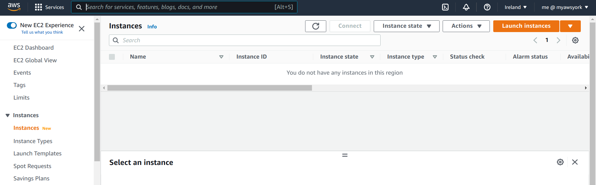

To create your key pair, you need to select the **Key Pairs**  menu under **Network & Security** in the left navigation pane.  

Scroll down the left navigation pane with the mouse until you see the **Key Pairs** menu and click on it.  The page below will be displayed:

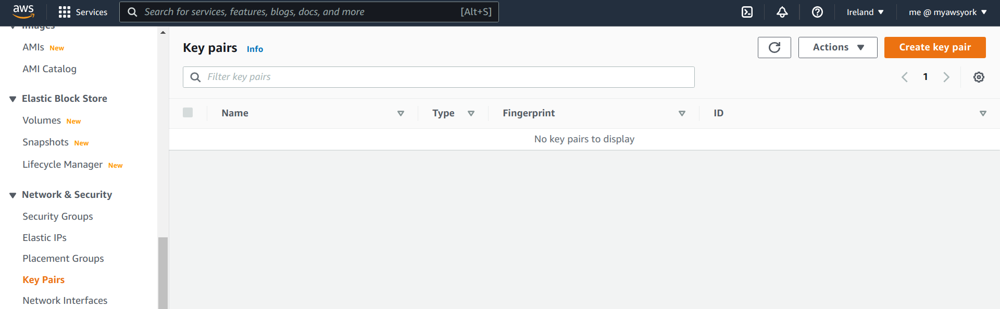

Now click on the orange button **Create key pair** on the top right. The page below will appear where you need to (1) enter a name for your key pair (choose a meaningful name --- you are going to save a file with that name for later use), and (2) select the options **RSA** and **.pem** as shown in the page. You don't need to add tags. Then click on **Create key pair** at the bottom right.

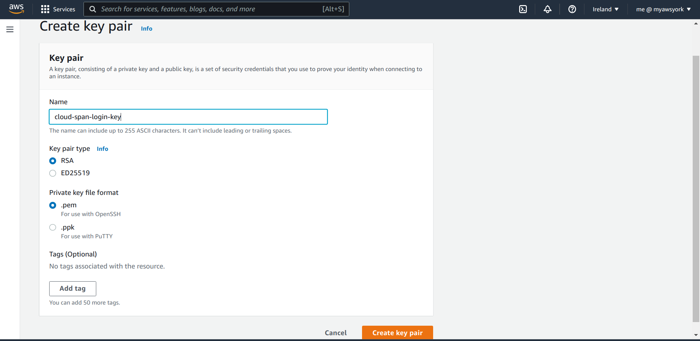

Once you click on the **Create key pair** button in the page above, a page like the one below will appear prompting you to save the key file that you will use to access your instance.

> ## Exercise
> Make a note of where you save your login key file. We recommend that you create a new directory to save the file and naming the directory such that it is related to your instance or the work you plan to carry out in your instance, for example: **cloud_genomics**  or **aws_instance** or **cloud-span-instance**. If you are Windows user, you may also want to create the directory in the Desktop so that you can easily access it.
{: .challenge}

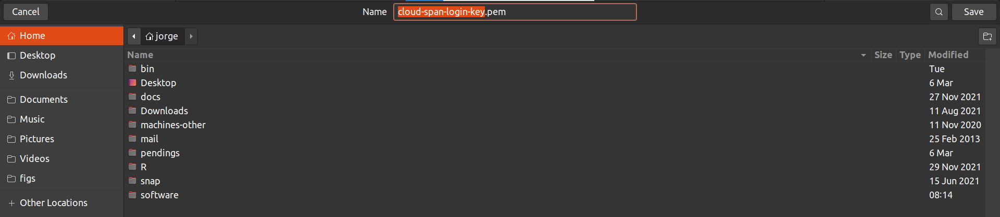

After you save your login key, a success page like the following will be diplayed.

# 3. Create a security group
To create your security group, you need to go to the **Security Groups** menu. It is just above the  **Key Pairs** menu on the left navigation pane. Click on it. The page below will appear:

Note in that page that your account comes with a default security group. However, we need to create a security group for use with your instance with a specific set of ports and settings.

Please click on the orange button **Create security group** on the top right. The page below will appear where you need to enter a name and a description for your security group (feel free to use our choices). 

Now scroll down the page until you see the heading **Inbound rules** as shown in the page below:

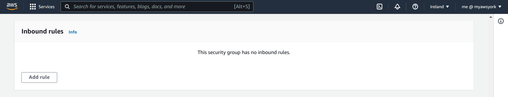

We are going to specify four inbound rules by clicking on the **Add rule** button four times. Then, for each rule we are going to make a few selections mostly with the mouse such that the four rules will look like those in the page below (see further instructions below the page):

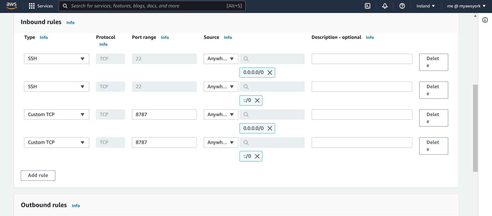

So click the **Add rule** button four times so that four rows appear. On the left column (labelled **Type**), on the first row, click on the drop-down menu button (the little black triangle) and select **SSH** --- you may need to scroll down with the mouse to see SSH. Do likewise on the left column second row. 

On the third column (labelled **Port range**), on the second and third rows, enter the number **8787**.  

On the fourht column (labelled **Source**), on the first row, click on the drop-down menu and select **Anywhere-IPv4**; on the second row do likewise but select **Anywhere-IPv6**; on the third row select **Anywhere-IPv4** and on the fourth row select **Anywhere-IPv6**. 

Your inbound rules should now look like those in the page above.

There is no need to define outbound rules nor tags. So scroll down til the end of the page until you see on the right the orange button **Create security group** and click on it. A page similar to the one below will appear summarising you security group configuration.

# 4. Create your instance using the Cloud-SPAN AMI as source

Creating your instance involves these steps:

4.1 Selecting the Cloud-SPAN AMI as source.

4.2 Selecting an instance type.

4.3 Selecting the security group.

4.4 Selecting the login key --- after this selection your instance will be automatically launched.

### 4.1. Selecting the Cloud-SPAN AMI

Use the left navigation pane to select and go to the **Instances** menu page, shown below. In this page, click on the orange button **Launch instances** on the top right.

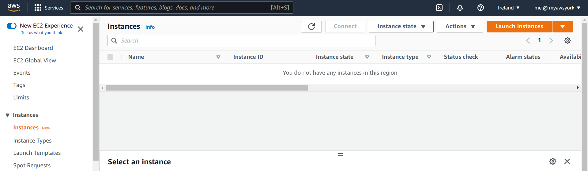

The page below will appear, wherein we are going to look for the Cloud-SPAN AMI whose full name and id is: 

**CSGC-AMI06-30GB-UsrKeyMng-NoAuthKeys - ami-0284fdb43f03d509f**.

Copy and paste only the ami-id **ami-0284fdb43f03d509f** into the AMI search box in the middle of the page and press Enter.  

The page should now display the Cloud-SPAN AMI full name and id in the middle as in the page below. 

Click on the blue button **Select** on the right to select it and go to the next step.

### 4.2. Select an instance type

The page below will appear after you have selected the Cloud-SPAN AMI in the page above. In the  page below your are to select the instance type for your instance. Usually the instance type **t2.micro** is selected (checked in blue) by default. This instance type is marked as being *Free tier eligible*, meaning that you will not incur costs for using this instance type for 12 months since you opened you account. 

We recommend that you use this instance type first and check if it has enough processing capacity for your work. You can easily change the instance type of your instance to an instance type with more capacity such as t2.small or t2.medium, as we will show you in the next episode.

Once you have selected the instance type for your instance, click on the option **6. Configure security group** at the top (we don't need to go through the other steps).  

### 4.3. Selecting your security group

The page below will appear, showing the option **Create a new security group** as being selected. As we have already created our security group, click on the option just below **Select and existing security group**. 

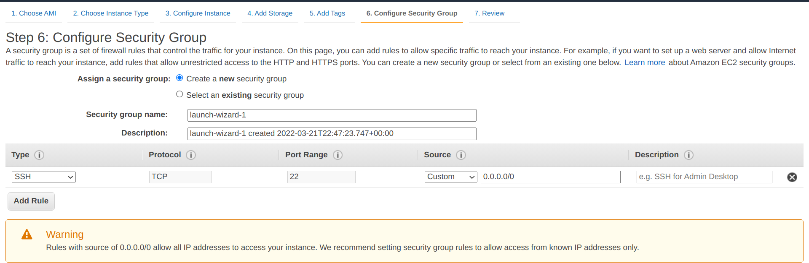

The page will be refreshed showing the default security group and the security group we created early. Select the one we created early as shown in the page, and then click on the blue button **Review and launch**.

The page below will appear, showing a summary of your instance configuration. You will need to scroll down the page with the mouse to see all the details.

Note the message in light yellow "Improve your instances' security. Your security group, Cloud-SPAN Security Group, is open to the world". It means that you can access your instance from anywhere in the world. It is of no concern as long as you don't share your login key file. 

Click on the blue button **Launch** on the bottom left. 

### 4.4. Selecting your login key - and launching your instance

The page below will appear, prompting you to select the login key to be used to access your instance. As we have already created a key pair, it will be selected as default and all you need to do is to check the box to acknowledge that you have saved and have access to the key file. 

Note that it reminds you that, if you don't have access to such file, you will not be able to access your instance. 

Once you check the acknowledge box, you will then be able to click on the blue button **Launch Instances**.  

**NB**: once you click on the **Launch Instances** button, your instance will be launched and will remain running until you stop it.  *If you selected an instance type other than t2.micro you will incur some cost*. 

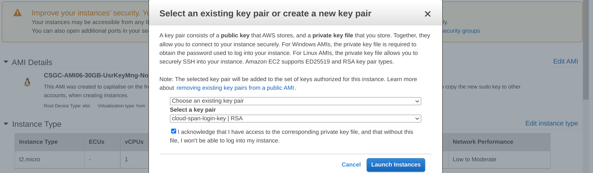

Once you click on the **Launch Instances** button, the page below will appear. Scroll down the page and click on the blue button **View Instances** to go the Instances menu page where you will see your instance in the state *Pending* or *Running*.

The next episode [Manage Your AWS Instance](../02-manage-aws-instance) will introduce you to a few management tasks you need to operate your instance. 

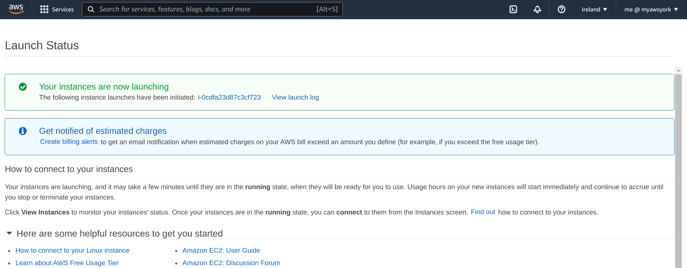

