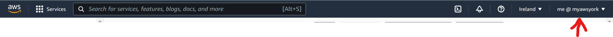
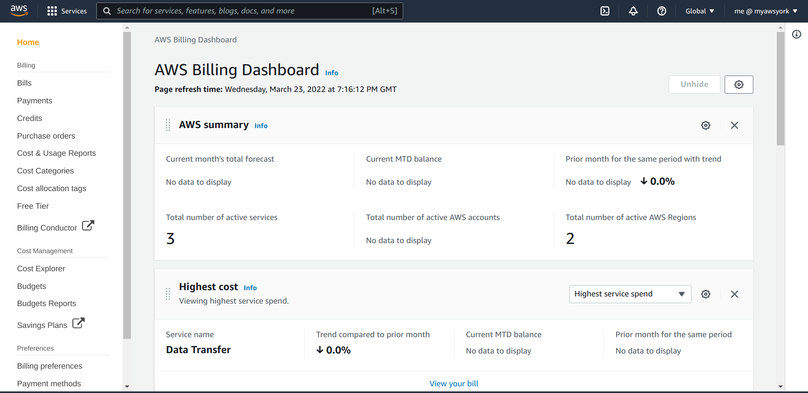
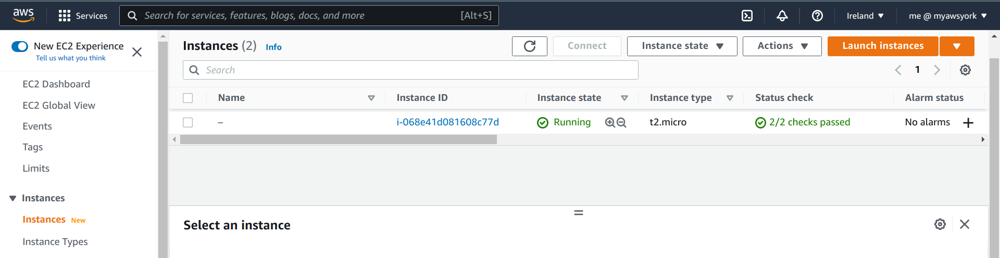
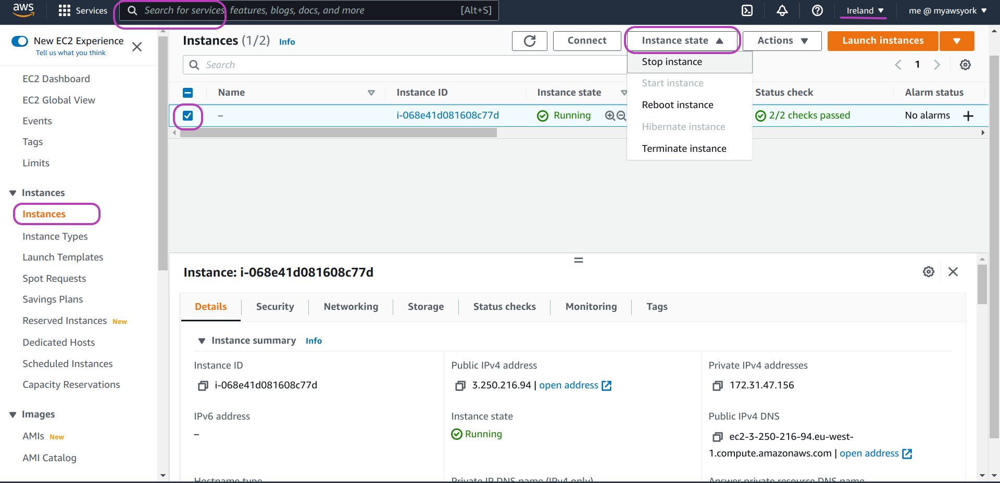
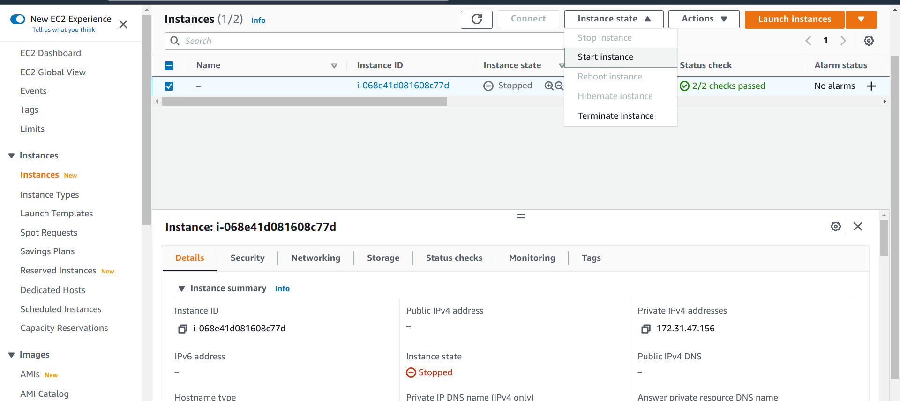
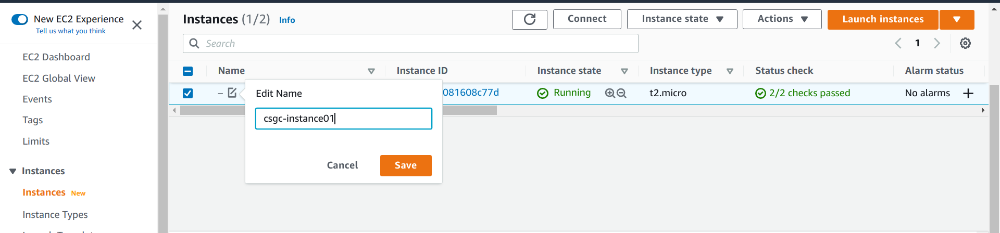
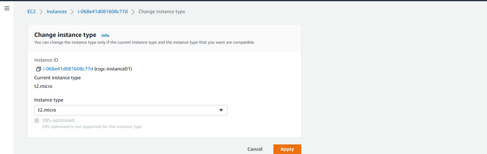

> ## Prerequisites
> To complete this episode you will need to have created your instance as described in the previous episode [Create Your AWS Instance](../01-create-aws-instance) and to login to your AWS IAM account as described in the previous episode too.
> 
> Windows users must have installed the Git Bash program --- see instructions here: [Installing Git Bash](https://cloud-span.github.io/prenomics00-intro/setup.html)
{: .prereq}

# Introduction
> ## Steps
> These are the base management tasks that you need to operate your instance that are covered below:
>
> 1. **Set up billing alerts**.\
> Setting up billing alerts in your account will allow to act promptly in case your account starts incurring costs you did not plan.
>
> 2. **Stop, start, reboot or terminate your instance**.\
> These are the base tasks you need to know to manage your instance. 
>
> 3. **Login to your instance**. \
> As launched, your instance has only access to an admin user account called **ubuntu**. We need to set up access to the Cloud-SPAN user account called **csuser** which is the account configured with both 'omics data and analysis tools.
>
> 4. **Update your instance type**.\
> It is easy to change the instance type of your instance in case you need more processing power. You will incur costs if you use an instance type other than the **t2.micro** instance type.
{: .callout}

# 1. Setup billing alerts
To setup billing alerts, go to the **Billing Dashboard** page as follows. Once you are logged in to your IAM account, click on the drop-down menu *user@accountalias* (or *user@accountnumber* if you did not create an alias) that is on the far right at the top, see figure below. Then, in the menu that will drop down, click on **Billing Dashboard** and the page below the figure will appear.

The Billing Dashboard page:

> ## Remember this:
> Once the Billing Dashboard page is displayed, the default region will have changed (from Ireland) to Global --- see the region in the figure and in the page above. This is because the configuration options in the Billing Dashboard apply to your account (which can access many AWS regions) and not to any specific region.  
> When you go back to EC2 menu pages, check that your default region is Ireland. Set it thus if not, as otherwise you will not find the instance you created in the Ireland region in the previous episode.
{: .callout}

To setup billing alerts, on the left navigation pane, click on **Billing preferences**.  The page below will appear. Check all the three options as shown in the page, and then click on the blue button **Save preferences**. 

# 2. Stop, start, reboot or terminate your instance

The base operations to manage your instance are: *stop*, *start*, *reboot* and *terminate* instance. You can invoke these operations on your instance depending on its state.

When you create and launch an instance it will be in the state *Pending* until its initialisation is complete --- a process that takes 1-2 minutes. Its state will then change to *Running* and will be in this state until you stop it. 

To stop (or to perform any other operation on) your instance you need to be in the Instance menu page. Type **ec2** in the AWS search box and press Enter. Check the default region is **Ireland**; set it thus if not.  Then on the left navigation pane, click on **Instances**. The page below will appear.

The state of your instance will be *Pending* or *Running*. Now check the box to the left of your instance entry and then click on the drop-down menu **Instance state**, see the page below. You need to check the box to the left of your instance to perform any operation on it.

The drop-down menu shows the operations you can perform while your instance is Running: Stop, Reboot and Terminate. You only need to click on the operation you want to be performed on your instance and it will be carried out. 

Click on **Stop instance**. The state of your instance will change to *Stopping* and eventually to *Stopped*, see the page below, where we have also clicked on **Instance state** to show the operations you can perform while your instance is *Stopped*. 

Note that you can *Terminate* your instance in any state. You **delete** an instance when you terminate it.  This operation is irreversible.  

*Start* your instance again if your stopped it, as you will need it *Running* to login to it in the next section.

# 3. Login to your instance

Windows users must have installed the Git Bash program to be able to complete this section (see instructions here [Installing Git Bash](https://cloud-span.github.io/prenomics00-intro/setup.html)).

To access your instance from your laptop or desktop machine, you need to use the program `ssh`. The term `ssh` stands for *Secure SHell*. `ssh` allows you to securely connect to remote machines through a so-called Command Line Interface (CLI), which is also widely known as *Terminal* or *Shell*. 

`ssh` is readily available on Linux and MacOS platforms when a Terminal is opened. For Windows users, `ssh` is installed when Git Bash is installed and is available once you run Git Bash.

In this section we are going to use `ssh` to access your instance in order to enable access to the Cloud-SPAN user account in your instance. You will then be able to access your Cloud-SPAN user account with `ssh`. Your instance is configured such that `ssh` must be used with the encrypted login key that you downloaded when you created your instance.

Open a Terminal. Windows users should run Git Bash which will open a terminal similar to that in Linux and MacOS. 

In the terminal that opens, you will then see the shell prompt which has this form: *username@machineid: current-directory  $*  

Prompts are configurable but most of them are configured to end with a dollar sign **$**. 

Typical Linux and MacOS users shell prompt:
~~~
username@machineid:~ $ 
~~~
{: .bash}

Typical Git Bash terminal prompt:
~~~
username@machineid MINGW64 ~
$
~~~
{: .bash}

The "username" and "machineid" in the code boxes above will be different in your terminal and will correspond to the actual username and the name of the machine you are using. The symbol **~** is a shell variable that holds the name your home directory (/home/username/ in Linux). 

In your terminal, use the the `cd` (change directory) command to go to the directory where you downloaded your login key file, and then the `ls` (list) command to list the content of the directory, as shown in the code boxes below.

The example code and output below shows that our directory to save our login key was called *cloud-span-instance* and that we created it in the Desktop (directory), and that our login key file was named *cloud-span-login-key.pem*. 

In following the example codes below, in your terminal you must enter the name of the directory you created to save your login key file and the name of your login key file. And you must press Enter at the end of each command.
~~~
username@machineid MINGW64 ~ 
$ cd Desktop/cloud-span-instance/ 

username@machineid MINGW64 ~/Desktop/cloud-span-instance
$ ls
~~~
{: .bash}

The `cd` command will **not** produce any output, but the prompt will be updated to display 
the name of the directory you changed to.

The output of the `ls` command will be this (in our case):
~~~
cloud-span-login-key.pem                                   
~~~
{: .output}

Enter the `chmod` (change access mode) command below to change the access permissions of your login key file:
~~~
usernam@machineid MINGW64 ~/Desktop/cloud-span-instance
$ chmod 700 cloud-span-login-key.pem
~~~
{: .bash}

There will be no output produced by `chmod`. As used above, `chmod` makes your login key file accessible to you only (and non-accessible to any other potential users of your computer), a condition that is required and checked by `ssh`.

Finally, the follwing command will enable access to your Cloud-SPAN user account. 
~~~
username@machineid MINGW64 ~/Desktop/cloud-span-instance
$ ssh -i cloud-span-login-key.pem ubuntu@ec2-54-195-163-61.eu-west-1.compute.amazonaws.com /home/ubuntu/bin/usersAccessKeys-setup-MAIN.sh
~~~
{: .bash}

Its output will be this:
~~~
usersAccessKeys-setup-MAIN.sh:  Setting up access keys for all users. Please wait.
Updating ~/.ssh/authorized_keys to have only the last key.
Copying .ssh/authorized_keys to user admin
Copying .ssh/authorized_keys to user csuser
DONE setting up access keys. Users should be able to login now.
~~~
{: .output}

If you get the following output message just before the output above, just type **yes** and press Enter to continue.
~~~
The authenticity of host 'ec2-54-195-163-61.eu-west-1.compute.amazonaws.com (54.195.163.61)' can't be established.
ED25519 key fingerprint is SHA256:o1D4h/Gz5TeeLCHmH1n7sVCtEvjsnViYG009M+GmkHI.
This key is not known by any other names
Are you sure you want to continue connecting (yes/no/[fingerprint])? yes
~~~
{: .output}

You should now be able to login to your Cloud-SPAN user account, which is called **csuser**, by typing the `ssh` comamnd below:
~~~
username@machineid MINGW64 ~/Desktop/cloud-span-instance
$ ssh -i cloud-span-login-key.pem csuser@ec2-54-195-163-61.eu-west-1.compute.amazonaws.com
~~~
{: .bash}

The output of this command will be the Cloud-SPAN logo and a new prompt with **csuser**, as shown below:
~~~
     ____ _                 _         ______ _____   _    __   _
    / ___| | ___  _   _  __| |       / ____ |  _  \ / \  |  \ | |
   | |   | |/ _ \| | | |/ _` |  ___  \___  \| |_) '/ _ \ | \ \| |
   | |___| | (_) | |_| | (_| | |___| ____)  |  __ / ___ \| |\ | |
    \____|_|\___/ \___/ \__,_|       \_____/|_|  /_/   \_|_| \__|

    G E N O M I C S     C O U R S E     E N V I R O N M E N T
    _____________________________________________________________
  
    Scroll up with the mouse for information before this welcome     
    Type "csguide" (and the Enter (↵) key) for some guidance
    _____________________________________________________________

Last login: Thu Mar 24 10:57:54 2022 from 88.105.248.80
csuser@ip-172-31-47-156:~ $ 
~~~
{: .output}

> ## Remember this:
> In the `ssh` commands above:
> - The part **-i your-login-key-file.pem** tells `ssh` the identity file it should use to login to your instance. `ssh` will only work if you first move with `cd` to the directory where your login key file is, and you should use the name of your file.
> - The part **ec2-54-195-163-61.eu-west-1.compute.amazonaws.com** is the *Public IPv4 DNS* address of our instance. You need to use the address of your instance. It is shown below how you will get it.  
> - We use the **ubuntu** user account in the first `ssh` command above, and the **csuser** account in the second command.  
>   - The 'omics data and analysis tools are only available in the **csuser** account.   
>   - The **ubuntu** account should only be used to update software system wide. 
{: .callout}

### Getting the *Public IPv4 DNS* of your instance

Your instance is configured to use a *dynamic* Public IPv4 DNS address. That means that that address will change every time you *Stop* and *Start* your instance. The part that changes is the four numbers between you 'ec2-' and '.eu-west-1.compute.amazonaws.com':

ec2-**54-195-163-61**.eu-west-1.compute.amazonaws.com

Once you start your instance (as described in section 2), you need to make a not of its address which you must then add to *yourusername@*, for example:

ssh -i your login-key-file.pem  **csuser@**ec2-54-195-163-61.eu-west-1.compute.amazonaws.com

ssh -i your login-key-file.pem  **ubuntu@**ec2-54-195-163-61.eu-west-1.compute.amazonaws.com

Once your start your instance in the EC2 Instance menu page, you will see the Public IPv4 DNS address of your instance at the bottom right, see the page below.  

Note that, for you to see the Public IPv4 address of your instance in the Instance menu page, your instance must have been checked (blue check box to the left of your instance entry), the **Details** menu must have been selected, and the drop-down menu **Instance summary** must have been clicked on. 

Copy and paste the address of your instance to the screen where you will issue the `ssh` command, add the username, etc., and press Enter to login to your instance.

BTW, notice in the page above that we have named our instance *csgc-instance01*. You don't need to name your instance because you only have one. However, if you start managing a few instances it is most convenient to name them so that you can more easily select the one you intend to apply an operation on.

To name your instance you only need to hoover the mouse pointer in the *Name* entry of your instance, click on it, type the name for your instance and press Enter or click on the **Save** button, see the page below.

# 4. Update your instance type

If you follow our suggestion to create your instance with the instance type t2.micro so that you don't incur costs under the *Free tier* (for 12 months since you opened your account), you should know that t2.micro has this configuration:

- 1 processor
- 1 GB (Giga Byte) memory

We believe this configuration is a good starting point while you become acquainted with your instance and the Cloud-SPAN resources inside it.  Eventually though, you may find that some of your analysis work takes too long to complete and you may be willing to incur some costs to improve the performance (reduce the response/execution time) of the applications you are using.

In that case you should update your instance type gradually, trying first the next higher level for some time, and if needed, changing to the next higher level.  After all, it is rather easy to change the instance type of your instance, as shown below.

> ## FYI: configuration of next higher-level instance types above t2.micro
> t2.small
> - 1 processor 
> - 2 GB memory
>
> t2.medium 
> - 2 processors
> - 4 GB memory
>
> t2.large
> - 2 processors
> - 8 GB memory
{: .callout}

To change the instance type of your instance, go to the EC2 Instance menu page, select your instance (check the box on the left of its entry), click on the drop-down menu **Actions** at the top, click on **Instance settings**, click on **Change instance type**, see the page below.   

After the last click on **Change instance type** above, the page below will appear showing the current type of your instance under the text *Instance type*. 

Click on the drop-down menu to the right of the name of your instance type (t2.micro in the page below):

You will then see the list of instance types you can choose from, as shown below. You may need to scroll the list up and down with the mouse, as the list is ordered alphabetically, meaning that t2.large and t2.medium will be above t2.micro while t2.small will be below in the list.

Click on the instance type you want to change to, and then click on the **Apply** button.

Finally, if you want to check that the configuration of your instance has changed according to the instance type you changed to, login to your instance (with *csuser*) and enter the commands `grep` and `nproc` as shown below to get displayed the amount of memory and the number processors available in your instance:

### Amount of memory available:
~~~
csuser@ip-172-31-47-156:~ $ grep MemTotal /proc/meminfo
~~~
{: .bash}

Instance type **t2.micro** memory size:
~~~
MemTotal:         992872 kB
~~~
{: .output}

Instance type **t2.small** memory size:
~~~
MemTotal:        2027624 kB
~~~
{: .output}

Instance type **t2.medium** memory size:
~~~
MemTotal:        4023048 kB
~~~
{: .output}

### Number of processors available:
~~~
csuser@ip-172-31-47-156:~ $ nproc
~~~
{: .bash}

Instance type **t2.micro** and **t2.small** number of processors:
~~~
1
~~~
{: .output}

Instance type **t2.medium** number of processors:
~~~
2
~~~
{: .output}

