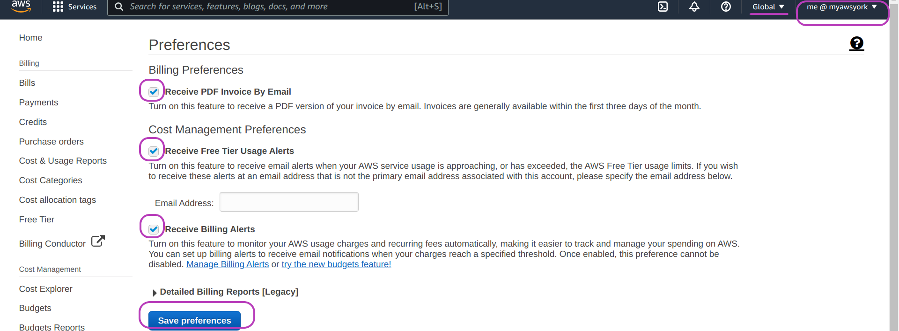
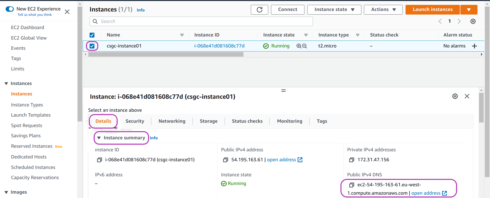
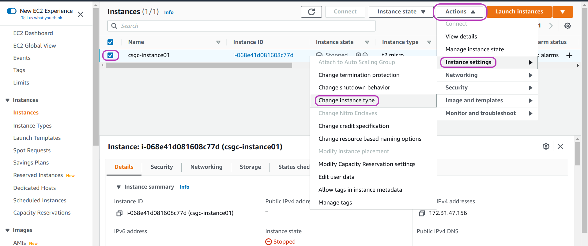

> ## Prerequisites
> To complete this episode you will need:
> - to have created your instance as described in the previous episode [Create Your AWS Instance](../01-create-aws-instance) and 
> - to login to your AWS IAM account as described in the previous episode too.
> 
> Windows users must have installed the Git Bash program --- see instructions here: [Installing Git Bash](https://cloud-span.github.io/prenomics00-intro/setup.html)
{: .prereq}

# Introduction
> ## Steps
> These are the base management tasks you need to operate your instance that are covered below:
>
> 1. [**Set up billing alerts**](#1-setup-billing-alerts).\
> Setting up billing alerts in your account will enable you to act promptly in case your account starts incurring costs you did not plan.
>
> 2. [**Stop, start, reboot or terminate your instance**](#2-stop-start-reboot-or-terminate-your-instance).\
> These are the base tasks you need to know to manage your instance. 
>
> 3. [**Make a note of the Public IPv4 DNS address of your instance**](#3-make-a-note-of-the-public-ipv4-dns-address-of-your-instance).
>  This is in the form\
*ec2-NN-NNN-NNN-NN.eu-west-1.compute.amazonaws.com* where the N indicate the numbers that identify the instance. It is a *dynamic* address so that these numbers change when you stop and start your instance.
> 
> 4. [**Login to your instance**](#4-login-to-your-instance). \
> As launched, your instance has only access to an admin user account called **ubuntu**. We need to set up access to the Cloud-SPAN user account called **csuser** which is the account configured with both 'omics data and analysis tools.
>
> 5. [**Update your instance type**](#5-update-your-instance-type).\
> It is easy to change the instance type of your instance in case you need more processing power. However, you will incur costs if you use an instance type other than the **t2.micro** instance type.
{: .callout}

# 1. Setup billing alerts
You have logged in to the AWS Console. To setup billing alerts, go to the **Billing Dashboard** using the drop-down menu *user@accountalias* (or *user@accountnumber* if you did not create an alias) on the top right, see the screenshot below.

On the Billing Dashboard page the region will be set to 'Global' on the top right. 

> ## Note
> The default region will have changed (from Ireland) to Global. This is because the configuration options in the Billing Dashboard apply to your account (which can access many AWS regions) and not to any specific region.  
{: .callout}

You will need to change the region to 'Ireland' once you setup the billing alerts.

To setup billing alerts select **Billing preferences** on the left navigation pane. Then check the following options:

1. Receive PDF invoice By Email
2. Receive Free Tier Usage Alerts
3. Receive Billing Alerts

And click on **Save prefences**. 

{: width="900px"}

# 2. Stop, start, reboot or terminate your instance

The operations to manage your instance are: *stop*, *start*, *reboot* and *terminate* instance. You can invoke these operations on your instance depending on its state.

When you create and launch an instance it will be in the state *Pending* until its initialisation is complete --- a process that takes 1-2 minutes. Its state will then change to *Running* and will be in this state until you stop it. 

To stop (or to perform any other operation on) your instance you need to be in the **Instances** menu page. Type **ec2** in the AWS search box at the top and press Enter. Check the default region is **Ireland**; set it thus if not.  Then on the left navigation pane, click on **Instances**. 

You should see your instance listed with a state of *Pending* or *Running*. Check the box to the left of your instance entry and then click on the drop-down menu **Instance state**. The drop-down menu shows the operations you can perform while your instance is *Running*, namely: Stop instance, Reboot instance and Terminate instance. 

, Reboot instance, Hibernate instance (greyed out) and Terminate instance."){: width="900px"}

Click on **Stop instance**. The state of your instance will change to *Stopping* and eventually to *Stopped*. The operations you can perform while your instance is *stopped* are: Start instance and Terminate instance. 

Note that you can invoke **Terminate instance** in any state. You **delete** an instance when you terminate it.  This operation is irreversible.  

**Start instance** again if you stopped it, as you will need it *Running* for the next section.

To name your instance point the mouse at the *Name* entry of your instance, click on it, type a name and press Enter. We used the name **csgc-instance01**. 

Naming your instance is not essential when you only have one instance but makes it easier when you are managing several instances.

 showing the Edit Name box which appears when you click on the Name entry. The name shows csgc-instance01"){: width="900px"}

# 3. Make a note of the *Public IPv4 DNS* address of your instance

To see the Public IPv4 DNS address of your instance, your instance must be running and selected in the **Instances** menu page: you have (1) checked the box to the left of your instance entry and (2) selected **Start instance** from the drop-down menu **Instance state**. 

Now select both the **Details** menu and then the **Instance summary** option on the left as shown in the page below. 

The Public IPv4 DNS address of your instance will be shown on the right.

The Public IPv4 DNS address is in the form **ec2-NN-NNN-NNN-NN.eu-west-1.compute.amazonaws.com** where the Ns indicate the numbers that identify the instance. It is a *dynamic* address so that these numbers change when you stop and start your instance.

{: width="900px"}

> ## Exercise
> You will need the Public IPv4 DNS address below. Make a note of it or copy it to a text file.
{: .challenge}

# 4. Login to your instance

In this section we are going to use `ssh` to access your instance in order to enable access to the Cloud-SPAN user account in your instance. You will then be able to access your Cloud-SPAN user account with `ssh` and your login key, the cloud-span-login-key.pem file you saved.

To login to your instance you'll need:
- the name of your instance (the Public IPv4 DNS address obtained above) 
- your login key file
- the shell/terminal/command line interface (CLI) application --- **Windows users** should have already installed the *Git Bash* shell; otherwise follow the directions in [Installing Git Bash](https://cloud-span.github.io/prenomics00-intro/setup.html)
- the *secure shell* (**ssh**) application, which is readily available in MacOS, Linux and Windows. **Windows users** will use ssh through Git Bash. 

As the name implies, **ssh** provides you with a secure (encrypted) way to use a remote *shell*.

### Open a Terminal and change the access permissions of your login key file

1. **Open the *cloud-span-instance* folder where you saved cloud-span-login-key.pem**

    Open your file manager and navigate to the `cloud-span-instance` folder (hint: we recommended you make the folder in your *Desktop* directory - but you might have made it somewhere else).

    The folder should contain the login key file, cloud-span-login-key.pem, and nothing else.

2. **Open your machine's shell application**

    For Windows users:

    - Right click anywhere inside the blank space of the file manager, then select **Git Bash Here**.
  
    For Mac users:

    - Open **Terminal** in one window and type `cd` followed by a space. Do not press enter! Now open **Finder** in another window. Drag and drop the `cloud-span-instance` folder from the Finder to the Terminal. You should see the file path leading to your `cloud-span-instance` folder appear. Now press enter to navigate to the folder.

    A new window will open - this is your command line interface, also known as the shell or the terminal. Once the terminal opens, it will display/output the **command prompt** to signal that it is ready to accept commands (instructions). The **command prompt** is 1 or 2 lines depending on your operating system (Windows, Linux, MacOS) and will be similar to the following.

    Typical command prompt for Windows Git Bash users:

    ~~~
    username@machineid MINGW64 ~
    $
    ~~~
    {: .output}

    Obviously "username" and "machineid" in the Output box above will be different when you open a terminal and will correspond to the actual username and the name of the machine you are using. 

    The character `$` is the typical ending of user prompts (the ending of admin users prompts is typically `#`). Commands you type will follow the `$`.
    

    Typical command prompt for Linux users:

    ~~~
    username@machineid:~ $
    ~~~
    {: .output}

    Typical command prompt for MacOS users:

    ~~~
    machineid:~ username $
    ~~~
    {: .output}
    
3. **Check that you are in the right folder**

    The terminal should have automatically set our `cloud-span-instance` folder as the current working directory. This is because we asked the terminal to open from a specific location.

    You can also check by typing the letters `ls` after the command prompt and pressing enter. This will list all the files in the working directory AKA all files in the `cloud-span-instance` folder. In our case, this should be just one file, the login key, `cloud-span-login-key.pem `.

4. **Change the access permissions of your login key file**

    Enter the following command to change the access permissions of your file:
    ~~~
    $ chmod 700 cloud-span-login-key.pem  
    ~~~
    {: .bash}

    The command `chmod` (change access mode) makes your login key file accessible to you only (and non-accessible to any other potential users of your computer), a condition that is required and checked by the program `ssh` that you will use next to login to your AWS instance. You will learn about file access permissions later in the course.

### Login to your instance with ssh

1. Copy and paste the command in the Code box below to your *terminal*:

    Windows Git Bash users only:
    - **copy** the command the usual Windows way: (1) highlight it with the mouse pointer while pressing the mouse left button and (2) press Ctrl-C (keys Ctrl and C simultaneously).
    - but **paste** it the Linux/Unix way: by pressing the mouse middle button while hovering the mouse pointer over the Git Bash window. (Try with the right button if the middle button doesn't work.) Alternatively, right click and select `paste`.
    Now use the back arrow to edit and replace the **NN-NNN-NNN-NN** with the numbers from your instance Public IPv4 DNS address.

    ~~~
    $ ssh -i cloud-span-login-key.pem ubuntu@ec2-NN-NNN-NNN-NN.eu-west-1.compute.amazonaws.com /home/ubuntu/bin/usersAccessKeys-setup-MAIN.sh
    ~~~
    {: .bash}

2. The terminal will display a security message, after you enter the `ssh` command, *similar* to the one below: 

    ~~~
    The authenticity of host 'ec2-NN-NNN-NNN-NN.eu-west-1.compute.amazonaws.com (NN.NNN.NNN.NN)' can't be established.
ED25519 key fingerprint is SHA256:o1D4h/Gz5TeeLCHmH1n7sVCtEvjsnViYG009M+GmkHI.
    This key is not known by any other names
    Are you sure you want to continue connecting (yes/no/[fingerprint])? yes 
    ~~~
    {: .output}

    Type **yes** and Enter

    
The output will be this:
~~~
usersAccessKeys-setup-MAIN.sh:  Setting up access keys for all users. Please wait.
Updating ~/.ssh/authorized_keys to have only the last key.
Copying .ssh/authorized_keys to user admin
Copying .ssh/authorized_keys to user csuser
DONE setting up access keys. Users should be able to login now.
~~~
{: .output}

You should now be able to login to your Cloud-SPAN user account, which is called **csuser**, by typing the `ssh` command below (obviously you need to change NN-NNN-.. as you did above):
~~~
username@machineid MINGW64 ~/Desktop/cloud-span-instance
$ ssh -i cloud-span-login-key.pem csuser@ec2-NN-NNN-NNN-NN.eu-west-1.compute.amazonaws.com
~~~
{: .bash}

The output of this command will be the Cloud-SPAN logo and a new prompt with **csuser**, as shown below:
~~~
     ____ _                 _         ______ _____   _    __   _
    / ___| | ___  _   _  __| |       / ____ |  _  \ / \  |  \ | |
   | |   | |/ _ \| | | |/ _` |  ___  \___  \| |_) '/ _ \ | \ \| |
   | |___| | (_) | |_| | (_| | |___| ____)  |  __ / ___ \| |\ | |
    \____|_|\___/ \___/ \__,_|       \_____/|_|  /_/   \_|_| \__|

    G E N O M I C S     C O U R S E     E N V I R O N M E N T
    _____________________________________________________________
  
    Scroll up with the mouse for information before this welcome     
    Type "csguide" (and the Enter (↵) key) for some guidance
    _____________________________________________________________

Last login: Thu Mar 24 10:57:54 2022 from 88.105.248.80
csuser@ip-172-31-47-156:~ $ 
~~~
{: .output}

> ## Remember this:
> In the `ssh` commands above:
> - The part **-i your-login-key-file.pem** tells `ssh` the identity file it should use to login to your instance. `ssh` will only work if the output of the command `ls` shows cloud-span-login-key.pem. That is, cloud-span-login-key.pem must be in your working directory.
> - The part **ec2-NN-NNN-NNN-NN.eu-west-1.compute.amazonaws.com** is the *Public IPv4 DNS* address of our instance. You need to use the address of your instance.
> - We use the **ubuntu** user account in the first `ssh` command above, and the **csuser** account in the second command.  
>   - You should use **csuser** for day-to-day work. The [Prenomics](https://cloud-span.github.io/prenomics00-intro/) and [Genomics](https://cloud-span.github.io/00genomics) data and tools are only available in the **csuser** account.   
>   - The **ubuntu** account should only be used for high level tasks. 
{: .callout}

# 5. Update your instance type

We instructed you to create your instance using the t2.micro intance type so that you don't incur costs under the *Free tier* (for 12 months since you opened your account). This instance type has the following configuration:

- 1 processor
- 1 GB (Giga Byte) memory

We believe this configuration is a good starting point while you become acquainted with your instance and Cloud-SPAN's [Prenomics](https://cloud-span.github.io/prenomics00-intro/) and [Genomics](https://cloud-span.github.io/genomics01-intro).  Eventually though, you may want explore with your own data and find that your analysis takes too long to complete. If you are willing to incur some costs to improve  performance (reduce the response/execution time) of the applications you are using you can update your instance type.

You should update your instance type gradually, trying first the next higher level for some time, and if needed, changing to the next higher level.  It is straightforward to change the instance type of your instance.

> ## FYI: configuration of next higher-level instance types above t2.micro
> t2.small
> - 1 processor 
> - 2 GB memory
>
> t2.medium 
> - 2 processors
> - 4 GB memory
>
> t2.large
> - 2 processors
> - 8 GB memory
{: .callout}

To change the instance type of your instance, go to the EC2 Instance menu page and select your instance (check the box on the left of its entry). Stop it if is not *Stopped*: select **Instance state** and then **Stop instance**. 

Then click on the drop-down menu **Actions** at the top, clock on **Instance settings**, click on **Change instance type** as shown in the figure below.

{: width="900px"}

In the page that appears you will see the current instance type of your instance: t2.micro. Click on the drop-down menu to display the list of instance types available and select one. Note that the list is ordered alphabetically not by size --- you may need to scroll up. Click on **Apply**.

{: width="900px"}

Finally, if you want to check that the configuration of your instance has changed according to the instance type you changed to, login to your instance (with *csuser*) and enter the commands `grep` and `nproc` as shown below to get displayed the amount of memory and the number processors available in your instance:

### Amount of memory available:
~~~
csuser@ip-172-31-47-156:~ $ grep MemTotal /proc/meminfo
~~~
{: .bash}

Instance type **t2.micro** memory size:
~~~
MemTotal:         992872 kB
~~~
{: .output}

Instance type **t2.small** memory size:
~~~
MemTotal:        2027624 kB
~~~
{: .output}

Instance type **t2.medium** memory size:
~~~
MemTotal:        4023048 kB
~~~
{: .output}

### Number of processors available:
~~~
csuser@ip-172-31-47-156:~ $ nproc
~~~
{: .bash}

Instance type **t2.micro** and **t2.small** number of processors:
~~~
1
~~~
{: .output}

Instance type **t2.medium** number of processors:
~~~
2
~~~
{: .output}

